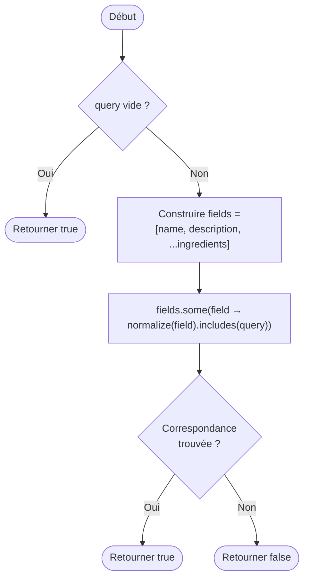

# Fiche d'investigation de fonctionnalité
## Fonctionnalité : Recherche principale de recettes

| Champ | Valeur |
|---|---|
| Fonctionnalité | Barre de recherche principale — filtrage des recettes |
| Cas d'utilisation | #03 – Filtrer les recettes dans l'interface utilisateur |
| Référence Mockup | #003 |
| Responsable | Jean-Baptiste A. |
| Version | 1.0 |
| Date | 2026-03-29 |

---

## Description de la fonctionnalité

L'utilisateur saisit un mot ou groupe de lettres dans la barre de recherche principale. À partir de 3 caractères, le système filtre en temps réel les recettes dont le **nom**, les **ingrédients** ou la **description** contiennent la saisie. Les résultats s'actualisent à chaque nouveau caractère.

Le cœur de l'algorithme est donc : *pour chaque recette du tableau, déterminer si elle correspond à la requête saisie*.

---

## Proposition 1 — Boucles natives (`for`)

### Description

Cette implémentation parcourt explicitement chaque champ de la recette avec une boucle `for` classique. Dès qu'une correspondance est trouvée dans l'un des champs, la fonction retourne `true` immédiatement (**court-circuit explicite**) sans inspecter les champs restants.

**Pseudocode :**

```
function recipeMatchesSearch(recipe, normalizedQuery):
  if normalizedQuery est vide → retourner true

  if normalize(recipe.name) contient normalizedQuery → retourner true
  if normalize(recipe.description) contient normalizedQuery → retourner true

  pour i de 0 à recipe.ingredients.length - 1:
    si normalize(recipe.ingredients[i].ingredient) contient normalizedQuery:
      retourner true

  retourner false
```

**Caractéristiques :**
- Pas d'allocation de tableau intermédiaire
- Sortie anticipée dès la première correspondance
- Lisibilité impérative proche du pseudocode

### Algorigramme

```mermaid
flowchart TD
    A([Début]) --> B{query vide ?}
    B -- Oui --> C([Retourner true])
    B -- Non --> D{name contient query ?}
    D -- Oui --> C
    D -- Non --> E{description contient query ?}
    E -- Oui --> C
    E -- Non --> F[i = 0]
    F --> G{i < ingredients.length ?}
    G -- Non --> H([Retourner false])
    G -- Oui --> I{ingredients\[i\] contient query ?}
    I -- Oui --> C
    I -- Non --> J[i++]
    J --> G
```

---

## Proposition 2 — Programmation fonctionnelle (`Array.some`)

### Description

Cette implémentation construit d'abord un tableau de tous les champs à inspecter (nom, description, ingrédients) en utilisant le spread operator et `Array.map`, puis appelle `Array.some` qui itère jusqu'à trouver la première correspondance (**court-circuit natif**).

**Pseudocode :**

```
function recipeMatchesSearch(recipe, normalizedQuery):
  if normalizedQuery est vide → retourner true

  fields = [
    recipe.name,
    recipe.description,
    ...recipe.ingredients.map(i → i.ingredient)
  ]

  retourner fields.some(field → normalize(field) contient normalizedQuery)
```

**Caractéristiques :**
- Style déclaratif, expressif et concis
- Court-circuit intégré à `.some()`
- Allocation d'un tableau intermédiaire `fields` à chaque appel
- Usage des méthodes natives de l'objet Array

### Algorigramme



---

## Comparaison prévisionnelle

| Critère | Proposition 1 — Boucles natives | Proposition 2 — Fonctionnelle |
|---|---|---|
| Lisibilité | Impérative, proche du pseudocode | Déclarative, concise |
| Allocation mémoire | Aucune (pas de tableau intermédiaire) | 1 tableau `fields` par appel |
| Court-circuit | Manuel (return anticipé) | Natif (`.some()`) |
| Maintenabilité | Légèrement plus verbeux | Plus facile à lire et modifier |
| Performance estimée | Potentiellement plus rapide | Légèrement pénalisé par l'allocation |

---

## Résultats des tests de performance

> *Section à compléter après les tests sur [Jsben.ch](https://jsben.ch)*

| Implémentation | Opérations / seconde | Écart relatif |
|---|---|---|
| Proposition 1 — Boucles natives | — | — |
| Proposition 2 — Fonctionnelle | — | — |

**Conditions du test :**
- Dataset : 50 recettes (`recipes.json`)
- Requête testée : `"tomate"` (correspond à plusieurs recettes)
- Navigateur : —
- Date du test : —

---

## Recommandation

> *Section à compléter après analyse des résultats de performance.*

---

*Fiche rédigée dans le cadre du Projet P7 — OpenClassroom — Développeur JavaScript React*
